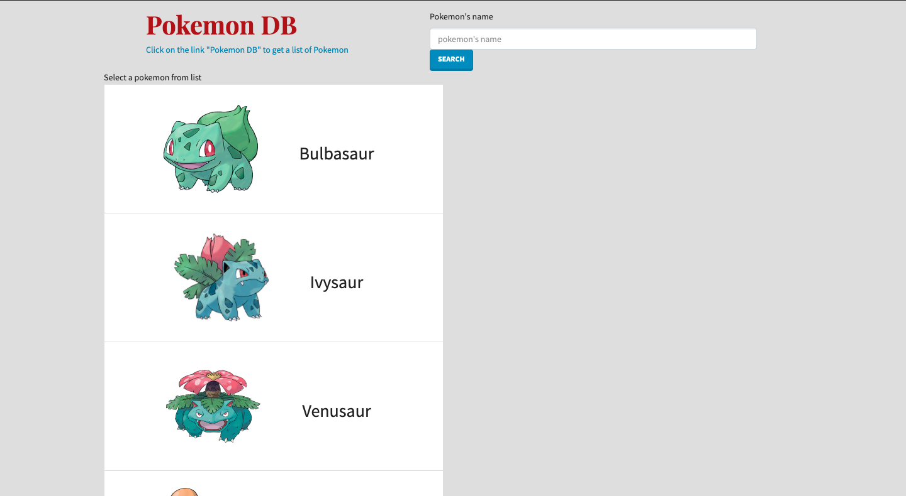

# Pokemon DB App (React, Redux, Bootstrap)

<a href="https://romanovroma.github.io/pokemon-db/" target="_blank">Check the Demo</a>

- React v17 (CRA)
- Routing
- Redux
- Bootstrap

⚙️ **To Run Locally**:

1. clone the repo;
2. use `npm install` to install all the dependencies;
3. use `npm start` to run locally
